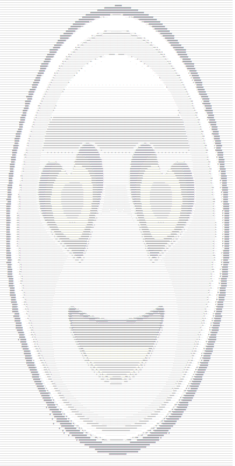

# Image to ASCII

This project converts images to an ASCII representation. 
I made this project in 2019 and I thought it would be cool to push it =)

Example convertion(original to the left, ASCII representation to the right): 

  
  

